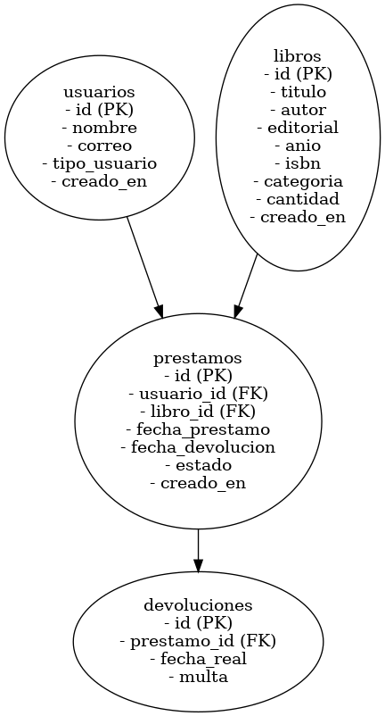
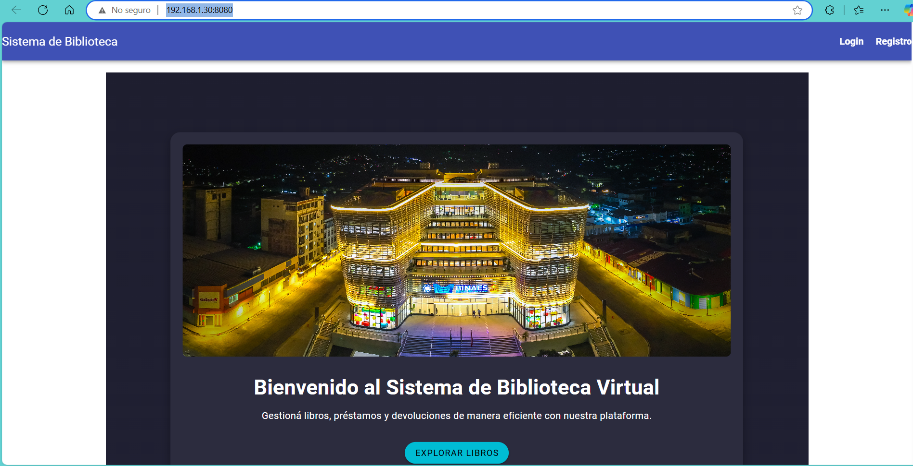
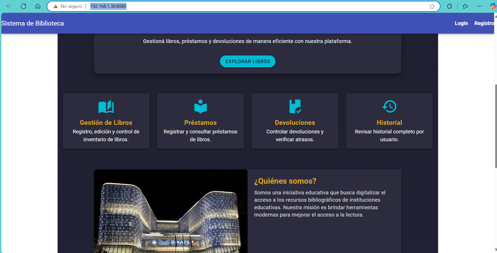
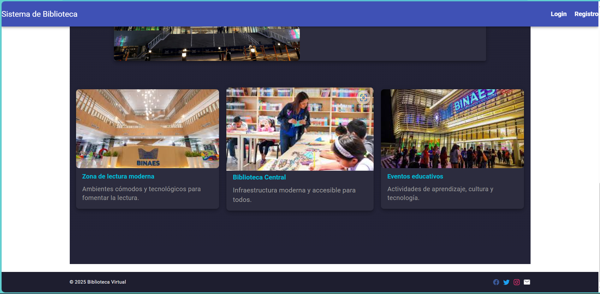
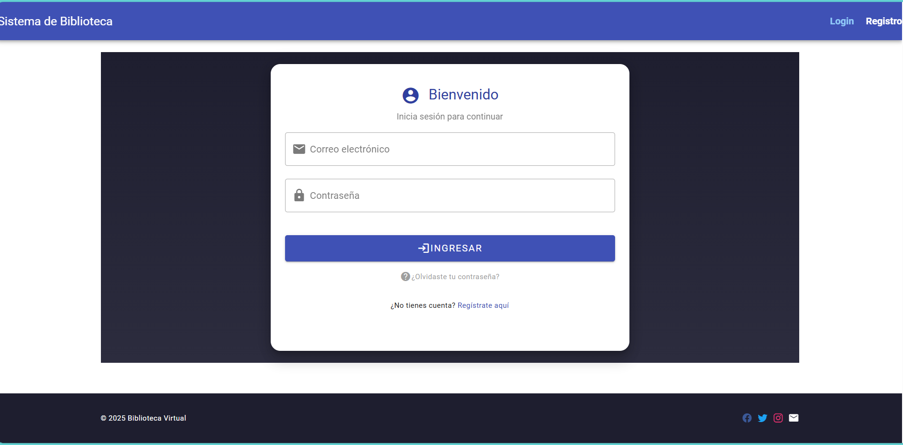
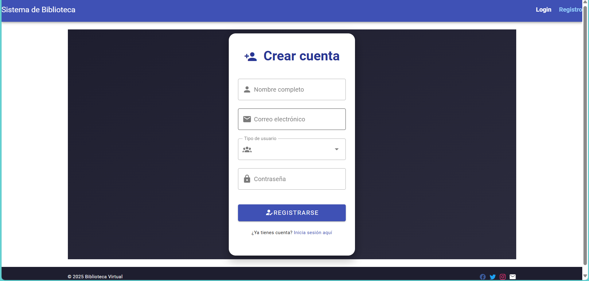

# Sistema de Biblioteca Virtual

Este proyecto es una aplicación web completa para la gestión de préstamos de libros en una biblioteca. Incluye módulos para el registro de usuarios, administración de libros, préstamos, devoluciones y consulta de historial, desarrollado con Laravel, Vue 3, Vuetify y MySQL.

Repositorio del proyecto: https://github.com/mike50561/proyecto-Bibliotecaa-PHP.git

# 🚀 Tecnologías utilizadas

- Frontend: Vue 3 (CLI 5.0.8), Vue Router, Vuetify 3

- Backend: Laravel 10.48.24

- Base de Datos: MySQL 8.0.39

Herramientas: Composer, XAMPP, VS Code, MySQL Workbench

# 📂 Instalación y ejecución

Clona el repositorio:

git clone https://github.com/mike50561/proyecto-Bibliotecaa-PHP.git

## Configura y ejecuta el backend:

- cd biblioteca-api
- composer install
- cp .env.example .env
- php artisan key:generate
- php artisan migrate
- php artisan serve

## Configura y ejecuta el frontend:

- cd biblioteca-frontend
- npm install
- npm run serve

Accede a:
- Frontend: http://localhost:8080
- Backend: http://127.0.0.1:8000

## 🔑 Credenciales de prueba
- Administrador precreado:
- Correo: admin@admin.com
- Contraseña: admin123

## ✉️ Autenticación

- Inicio de sesión y registro con validaciones

- Roles: admin, estudiante, profesor

## 📚 Libros

Listado de libros, Registro, edición y eliminación (solo admin)

## ✉️ Préstamos

- Registro de préstamos (admin)

- Selección de libro y usuario

## ♻️ Devoluciones

- Marcar préstamos como devueltos (admin)

- Estado actualizado en tiempo real

## 📅 Historial

- Consulta de historial de préstamos por usuario (admin)

- Generación de PDF por usuario

- Vista de historial personal para estudiantes y profesores

## 📝 Diagrama de base de datos

  

##  Tablas principales

- usuarios: Almacena la información de usuarios con roles

- libros: Catálogo de libros disponibles

- prestamos: Registra los préstamos realizados

- devoluciones: Marca los préstamos devueltos

## 📸 Capturas de pantalla
- 
- 
- 
- 
- 

## 🚪 Roles y permisos

#### Rol: Admin:CRUD de libros, registrar préstamos, devoluciones, historial

#### Profesor: Visualizar libros y su propio historial

#### Estudiante: Igual que profesor

## 🏖️ Contribución

Este proyecto fue desarrollado como practica de alquirir conocimiento en la tecnologia implementada  y puede servir como base para futuros sistemas educativos o de gestión documental.

## 👨‍💼 Autor

Miguel Angel Herrera, estudiante Tecnico de ingenieria en Computacion - proyecto 

